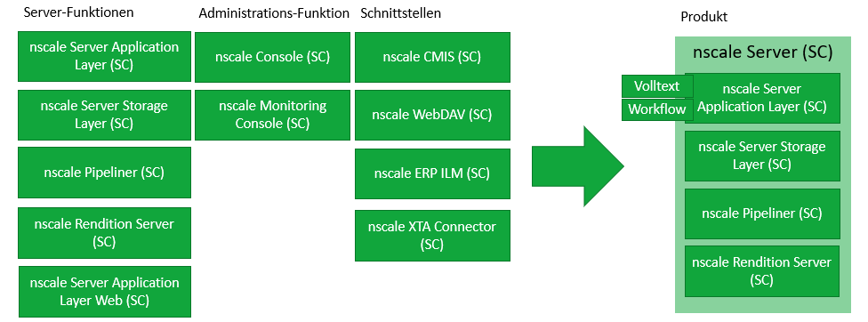
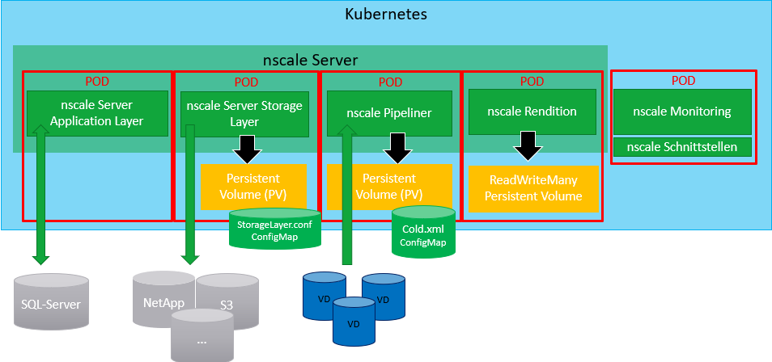

# nscale Standard Container

nscale ist eine Informationsplattform und vereint sämtliche Vorteile eines Enterprise Information Management Systems. Der Nutzen von nscale ist vielfältig. Er beginnt bei einer einfachen und stabilen Dokumentenarchivierung und endet noch lange nicht beim Aufbau einer unternehmensweiten Informationsplattform zur Organisation von Daten und Inhalten. Denn ein Dokument ist oft wesentlich mehr als nur eine Datei. nscale unterstützt Sie nicht nur bei der Strukturierung, Archivierung und rechtssicheren, gesetzeskonformen Ablage: nscale macht Ihre Informationen wertvoll. Darin liegt der große Unterschied zu anderen Systemen.

Für mehr Informationen besuchen Sie unsere Website unter <https://www.ceyoniq.com/>.

## Inhalt

- [nscale Standard Container](#nscale-standard-container)
  - [Inhalt](#inhalt)
  - [Informationen zu diesem Dokument](#informationen-zu-diesem-dokument)
  - [Softwarevoraussetzungen](#softwarevoraussetzungen)
  - [Lizenzierung](#lizenzierung)
  - [nscale Standard Container Produktfamilie](#nscale-standard-container-produktfamilie)
    - [Images](#images)
    - [nscale Server Standard Container](#nscale-server-standard-container)
    - [Produktmerkmale](#produktmerkmale)
    - [Notwendige Rahmenparameter zum Betrieb der Komponenten](#notwendige-rahmenparameter-zum-betrieb-der-komponenten)
  - [Betrieb mit Docker](#betrieb-mit-docker)
  - [Betrieb mit Docker-Compose](#betrieb-mit-docker-compose)
  - [Betrieb mit Kubernetes](#betrieb-mit-kubernetes)

## Informationen zu diesem Dokument

Bei diesem Dokument handelt es sich um die Dokumentation verschiedener nscaleServerkomponenten und Konnektoren im Container-Betrieb. Dabei richtet sich dieses Dokument ausdrücklich Personen, die sich mit der Administration von nscale beschäftigen.

> Weiter Informationen zum Betrieb von nscale finden Sie in unserem Serviceportal unter <https://serviceportal.ceyoniq.com/>.

## Softwarevoraussetzungen

Für den Betrieb von nscale Standard Container muss Ihr System die folgenden Mindestvoraussetzung erfüllen:

- min. 4 GB RAM
- weitere Software bzw. Hardwarevoraussetzungen aus dem Installationshandbuch der jeweiligen Komponente bzw. des Konnektors.
Die gesamte nscale-Dokumentation finden Sie in unserem Serviceportal unter <https://serviceportal.ceyoniq.com/>.

Außerdem müssen Sie ggf. einige Programme von Drittanbietern installiert haben, um nscale Standard Container starten, betreiben und überwachen zu können. Diese sind:

- **Docker** ab Version 20.10.2
  - oder eine vergleichbare Container-Laufzeitumgebung für OCI-kompatible Container
- **Docker-Compose** ab Version 1.27.4
- **Kubernetes** ab Version 1.19.3

Alle nscale Standard Container sind **Linux**-Container.  
Für Test- und Entwicklungssysteme können Sie [Docker Desktop for Windows](https://docs.docker.com/docker-for-windows/install/) verwenden.

Weitere Informationen zu Docker und Kubernetes finden Sie unter <https://www.docker.com/>.

## Lizenzierung

Der Betrieb von nscale Standard Container benötigt eine nscale Standard Container-Lizenz. Lizenzen, die nicht für den Container-Betrieb von nscale ausgestellt wurden, können nicht verwendet werden.
Lizenzen können beim Vertrieb der Ceyoniq GmbH erworben werden.  
Sollten Sie trotz Verwendung einer gültigen Container-Lizenz Probleme haben, wenden Sie sich bitte an den [Ceyoniq Service](docs/de/service-und-support.md).

## nscale Standard Container Produktfamilie

### Images

Alle nscale Standard Container-Images finden Sie im folgenden Repository: <https://hub.docker.com/u/nscale>  

Folgende Komponenten und Konnektoren nscale stehen als Standard Container zum Download zur Verfügung:

- [nscale Server Application Layer](docs/de/application-layer.md)
- [nscale Server Storage Layer](docs/de/storage-layer.md)
- [nscale Server Application Layer Web](docs/de/application-layer-web.md)
- [nscale Rendition Server](docs/de/rendition-server.md)
- [nscale Console](docs/de/console.md)
- [nscale Monitoring Console](docs/de/monitoring-console.md)
- [nscale Pipeliner](docs/de/pipeliner.md)
- [nscale CMIS-Connector](docs/de/cmis-connector.md)
- [nscale WebDAV-Connector](docs/de/webdav-connector.md)
- [nscale ERP Connector ILM](docs/de/ilm-connector.md)

### nscale Server Standard Container

Der nscale Server Standard Container besteht aus den Komponenten nscale Server Application Layer, nscale Server Storage Layer, nscale Pipeliner und nscale Rendition Server.

>Hinweis  
nscale Server Standard Container ist kein Produkt, sondern eine Vertriebsdefinition der Komponenten, die einen nscale Server ausmachen.

### Produktmerkmale

| Komponente | Lizenz benötigt | Steuerung über Umgebungsvariablen | Autoscaling* | Loadbalancing** |
|---|---|---|---|---|
|nscale Server Application Layer|Ja|Ja|Ja|Ja|
|nscale Server Application Layer Web|Ja|Ja|Ja|Ja|
|nscale Server Storage Layer|Ja|Ja|Nein|Nein|
|nscale Rendition Server|Ja|Ja|Ja|Ja|
|nscale Pipeliner|Ja|Nein|Nein|Nein|
|nscale Console|Nein|Ja|Ja|Ja|
|nscale Monitoring Console|Ja|Ja|Nein|Nein|
|nscale CMIS-Connector|Ja|Ja|Ja|Ja|
|nscale WebDAV-Connector|Ja|Ja|Ja|Ja|
|nscale ERP Connector ILM|Ja|Ja|Ja|Ja|

(*) Die Komponente kann über einen [Horizontal Pod Autoscaler](https://kubernetes.io/docs/tasks/run-application/horizontal-pod-autoscale-walkthrough/) in Kubernetes skaliert werden.  
(**) Die Komponente kann über einen [Service](https://kubernetes.io/docs/concepts/services-networking/service/) in Kubernetes Loadbalancing durchführen.

### Notwendige Rahmenparameter zum Betrieb der Komponenten

In dieser schematischen Darstellung sehen Sie eine Beispielarchitektur für den nscale Server im Containerumfeld.
Der nscale Server wurde innerhalb eines Namespaces mit dem Namen "nscale Server" installiert und besteht aus nscale Server Application Layer, nscale Server Storage Layer, nscale Pipeliner und nscale Rendition Server.
Die Server-Komponenten sind dabei jeweils in einzelnen Pods installiert.
In einem fünften Pod sind nscale Monitoring Console und die nscale Schnittstellen installiert.
Dieser Pod befindet sich außerhalb des Namespaces.

Um den Betrieb der einzelnen Server-Komponenten zu gewährleisten, müssen jeweils Rahmenparameter eingehalten werden.
nscale Server Application Layer benötigt eine Verbindung zu einer Datenbank.
Im Pod von nscale Server Storage Layer müssen Sie ein Persistent Volume definieren.
Weiter benötigt nscale Server Storage Layer eine Verbindung zu mindestens einem Speichermedium.
Im Pod von nscale Pipeliner müssen Sie ebenfalls ein Persistent Volume definieren. nscale Pipeliner benötigt außerdem Zugriff auf eine Konfigurationsdatei (Cold.xml) und die Verarbeitungsdateien (VD), die er verarbeiten soll.
Im Pod von nscale Rendition Server müssen Sie ein ReadWriteMany Persistent Volume definieren.

Informationen dazu, wie Sie Verbindungen zu Datenbanken oder Speichermedien einrichten, finden Sie unter [nscale Server Application Layer](docs/de/application-layer.md)
und [nscale Server Application Layer Web](docs/de/application-layer-web.md)
bzw. [nscale Server Storage Layer](docs/de/storage-layer.md).

## Betrieb mit Docker

Sie können die jeweiligen nscale Standard Container mit Docker, oder einer kompatiblen Laufzeitumgebung für OCI-Container betreiben.
In der hier vorliegenden Kurzdokumentation und ggf. in der weiterführenden Dokumentation in unserem [Serviceprotal](<https://serviceportal.ceyoniq.com/>) der jeweiligen Komponenten finden sie die notwendigen Informationen zu allen Umgebungsvariablen und den notwendigen Konfigurationen.

Wir empfehlen allerdings den Einsatz von Docker-Compose oder Kubernetes.  

## Betrieb mit Docker-Compose

>Dieses Repository beinhaltet **Beispielkonfigurationen**. Für Produktivsysteme müssen ggf. Anpassungen vornehmen. Unter anderem müssen geeignete Volumes konfiguriert werden damit Ihre Daten persistiert werden.

Der Betrieb mit Docker-Compose ist eine Möglichkeit nscale Standard Container zu betreiben.  
Bei Docker-Compose handelt es sich um ein Tool, mit dem Sie aus mehreren Containern bestehende Docker-Applikationen definieren und betreiben können.
In der Compose-Umgebung verwenden Sie eine .yml-Datei zur Konfiguration.
So können Sie auch komplizierte Services mit nur einem Kommando hochfahren.  

Weitere Informationen zu Docker-Compose finden Sie  unter <https://docs.docker.com/compose/>.  

In den folgenden Fällen empfehlen wir Ihnen die Verwendung von Docker-Compose für den Betrieb von nscale Standard Container:

- im Single-Server-Betrieb
- für die Entwicklung
- um eine erste Demo von nscale im Container Betrieb anzusehen

Eine genaue Beschreibung der Konfiguration von nscale im Betrieb mit Docker-Compose finden Sie unter [compose](docs/de/compose.md).

## Betrieb mit Kubernetes

>Dieses Repository beinhaltet **Beispielkonfigurationen**. Für Produktivsysteme müssen ggf. Anpassungen vornehmen. Unter anderem müssen geeignete Volumes konfiguriert werden damit Ihre Daten persistiert werden.

Bei Kubernetes handelt es sich um eine portable, erweiterbare Open-Source-Plattform zur Verwaltung von containerisierten Arbeitslasten und Services, die sowohl die deklarative Konfiguration als auch die Automatisierung erleichtert.
Kubernetes zeichnet sich durch ein großes, schnell wachsendes Ökosystem aus.
Kubernetes Dienstleistungen, Support und Tools sind weit verbreitet.  

Weitere Informationen zu Kubernetes finden Sie unter <https://kubernetes.io/de/>.

Der Betrieb von nscale Standard Container mit Kubernetes hat folgende Vorteile:

- Clusterbildung möglich
- Fehlertoleranz
- flexible Skalierbarkeit

Eine genaue Beschreibung der Konfiguration von nscale Standard Container im Betrieb mit Kubernetes finden Sie unter [kustomize](docs/de/kustomize.md).
