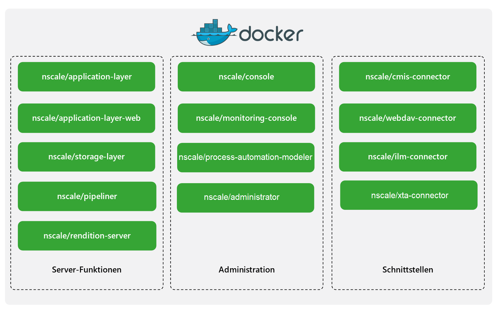

# nscale Standard Container

nscale ist eine Informationsplattform und vereint sämtliche Vorteile eines Enterprise Information Management Systems. Der Nutzen von nscale ist vielfältig. Er beginnt bei einer einfachen und stabilen Dokumentenarchivierung und endet noch lange nicht beim Aufbau einer unternehmensweiten Informationsplattform zur Organisation von Daten und Inhalten. Denn ein Dokument ist oft wesentlich mehr als nur eine Datei. nscale unterstützt Sie nicht nur bei der Strukturierung, Archivierung und rechtssicheren, gesetzeskonformen Ablage: nscale macht Ihre Informationen wertvoll. Darin liegt der große Unterschied zu anderen Systemen.

Für mehr Informationen besuchen Sie unsere Website unter <https://www.ceyoniq.com/>.

## Inhalt

- [nscale Standard Container](#nscale-standard-container)
  - [Inhalt](#inhalt)
  - [Informationen zu diesem Dokument](#informationen-zu-diesem-dokument)
  - [Softwarevoraussetzungen](#softwarevoraussetzungen)
  - [Lizenzierung](#lizenzierung)
  - [nscale Standard Container-Images](#nscale-standard-container-images)
  - [Produktmerkmale](#produktmerkmale)
  - [Betrieb](#betrieb)
  - [Betrieb mit Docker](#betrieb-mit-docker)
  - [Betrieb mit Docker-Compose](#betrieb-mit-docker-compose)
  - [Betrieb mit Kubernetes](#betrieb-mit-kubernetes)
  - [Limitierungen](#limitierungen)
  - [FAQ](#faq)
  - [Externe Quellen](#externe-quellen)

## Informationen zu diesem Dokument

Bei diesem Dokument handelt es sich um die Dokumentation verschiedener nscale Komponenten im Container-Betrieb. Dabei richtet sich dieses Dokument ausdrücklich an Personen, die sich mit dem Betrieb von nscale beschäftigen.

> Weitere Informationen zum Betrieb von nscale finden Sie in unserem Serviceportal unter <https://serviceportal.ceyoniq.com/>.

## Softwarevoraussetzungen

Für den Betrieb von nscale Standard Container muss Ihr System die folgenden Mindestvoraussetzung erfüllen:

- min. 4 GB RAM
- weitere Software bzw. Hardwarevoraussetzungen finden Sie im Installationshandbuch der jeweiligen Komponenten.
Die gesamte nscale-Dokumentation finden Sie in unserem Serviceportal unter <https://serviceportal.ceyoniq.com/>.

Außerdem müssen Sie ggf. einige Programme von Drittanbietern installieren, um nscale Standard Container starten, betreiben und überwachen zu können. Diese sind:

- **Docker** ab Version 20.10.2
  - oder eine vergleichbare Container-Laufzeitumgebung für OCI-kompatible Container
- **Docker-Compose** ab Version 1.27.4
- **Kubernetes** ab Version 1.19.3

Alle nscale Standard Container sind **Linux**-Container.  

Für Test- und Entwicklungssysteme können Sie unter anderem [Docker Desktop for Windows](https://docs.docker.com/docker-for-windows/install/) oder [Docker Desktop for Mac](https://hub.docker.com/editions/community/docker-ce-desktop-mac) verwenden.

Weitere Informationen zu Docker finden Sie unter <https://www.docker.com/>.  
Weitere Informationen zu Kubernetes finden Sie unter <https://kubernetes.io/>.

## Lizenzierung

Der Betrieb von nscale Standard Container benötigt eine nscale Standard Container-Lizenz. Lizenzen, die nicht für den Container-Betrieb von nscale ausgestellt wurden, können nicht verwendet werden.
Lizenzen können beim Vertrieb der Ceyoniq GmbH erworben werden.  
Sollten Sie trotz Verwendung einer gültigen Container-Lizenz Probleme haben, wenden Sie sich bitte an den [Ceyoniq Service](docs/de/service-und-support.md).

## nscale Standard Container-Images

Alle nscale Standard Container-Images finden Sie im folgenden Repository: <https://hub.docker.com/u/nscale>  

Folgende Komponenten stehen als nscale Standard Container zur Verfügung:

- [nscale/application-layer (nscale Server Application Layer)](components/application-layer.md)
- [nscale/application-laye-web (nscale Server Application Layer Web)](components/application-layer-web.md)
- [nscale/storage-layer (nscale Server Storage Layer)](components/storage-layer.md)
- [nscale/rendition-server (nscale Rendition Server)](components/rendition-server.md)
- [nscale/console (nscale Console)](components/console.md)
- [nscale/monitoring-console (nscale Monitoring Console)](components/monitoring-console.md)
- [nscale/pipeliner (nscale Pipeliner)](components/pipeliner.md)
- [nscale/cmis-connector (nscale CMIS-Connector)](components/cmis-connector.md)
- [nscale/webdav-connector (nscale WebDAV-Connector)](components/webdav-connector.md)
- [nscale/ilm-connector (nscale ERP Connector ILM)](components/ilm-connector.md)

> Wir übernehmen keine Gewährleistung und Haftung für die Funktionsfähigkeit, Verfügbarkeit, Stabilität und Zuverlässigkeit von Software von Drittanbietern die nicht Teil der nscale Standard Container sind.

## Produktmerkmale

| Komponente | Lizenz benötigt | Steuerung über Umgebungsvariablen | Autoscaling* | Loadbalancing** |
|---|---|---|---|---|
|nscale Server Application Layer|Ja|Ja|Ja|Ja|
|nscale Server Application Layer Web|Ja|Ja|Ja|Ja|
|nscale Server Storage Layer|Ja|Ja|Nein|Nein|
|nscale Rendition Server|Ja|Ja|Ja|Ja|
|nscale Pipeliner|Ja|Nein|Nein|Nein|
|nscale Console|Nein|Ja|Ja|Ja|
|nscale Monitoring Console|Ja|Ja|Nein|Nein|
|nscale CMIS-Connector|Ja|Ja|Ja|Ja|
|nscale WebDAV-Connector|Ja|Ja|Ja|Ja|
|nscale ERP Connector ILM|Ja|Ja|Ja|Ja|

(*) Die Komponente kann über einen [ReplicaSet](https://kubernetes.io/docs/concepts/workloads/controllers/replicaset/) in Kubernetes skaliert werden.  
(**) Die Komponente kann über einen [Service](https://kubernetes.io/docs/concepts/services-networking/service/) in Kubernetes Loadbalancing durchführen.

## Betrieb

## Betrieb mit Docker

Sie können die jeweiligen nscale Standard Container mit Docker, oder einer kompatiblen Laufzeitumgebung für OCI-Container betreiben.
Wir empfehlen den Einsatz von Docker-Compose oder Kubernetes.  
Weitere Informationen zum Betrieb der nscale Standard Container mit Docker, finden Sie in den jeweiligen Dokumentationen der Komponenten.

[Liste aller nscale Server Standard Container](#nscale-standard-container-images)

## Betrieb mit Docker-Compose

>Dieses Repository beinhaltet **Beispielkonfigurationen**. Für Produktivsysteme müssen ggf. Anpassungen vornehmen.

Der Betrieb mit Docker-Compose ist eine Möglichkeit nscale Standard Container zu betreiben.  
Bei Docker-Compose handelt es sich um ein Tool, mit dem Sie aus mehreren Containern bestehende Applikation definieren und betreiben können.

Weitere Informationen zu Docker-Compose finden Sie  unter <https://docs.docker.com/compose/>.  

Der Betrieb von nscale Standard Container mit Docker-Compose hat folgende Vorteile:

- sehr einfache Installation im Single-Server-Betrieb
- für die Entwicklung mit nscale
- schnelles erzeugen eines Demo- und Test-Systems

Eine genaue Beschreibung der Konfiguration von nscale im Betrieb mit Docker-Compose finden Sie unter  

[nscale Standard Container in Docker-Compose](compose.md).

## Betrieb mit Kubernetes

>Dieses Repository beinhaltet **Beispielkonfigurationen**. Für Produktivsysteme müssen ggf. Anpassungen vornehmen.

Bei Kubernetes handelt es sich um eine portable, erweiterbare Open-Source-Plattform zur Verwaltung von containerisierten Arbeitslasten und Services, die sowohl die deklarative Konfiguration als auch die Automatisierung erleichtert.
Kubernetes zeichnet sich durch ein großes, schnell wachsendes Ökosystem aus.
Kubernetes Dienstleistungen, Support und Tools sind weit verbreitet.  

Weitere Informationen zu Kubernetes finden Sie unter <https://kubernetes.io/>.

Der Betrieb von nscale Standard Container mit Kubernetes hat folgende Vorteile:

- Clusterbildung möglich
- Fehlertoleranz
- flexible Skalierbarkeit
- einfache Installation in Cloud-Umgebungen (z.B in [Microsoft Azure Kubernetes Service - AKS](https://azure.microsoft.com/de-de/services/))

Eine genaue Beschreibung der Konfiguration von nscale Standard Container im Betrieb mit Kubernetes finden Sie unter  

[nscale Standard Container mit Kubernetes](kubernetes.md).

## Limitierungen

Informationen zu Limitierungen finden Sie hier: [limitation.md](limitation.md)

## FAQ

Das FAQ finden Sie hier: [faq.md](faq.md)

## Externe Quellen

- <https://github.com/kubernetes/kubernetes/tree/master/logo>
- <https://commons.wikimedia.org/wiki/File:Docker_(container_engine)_logo.png>
