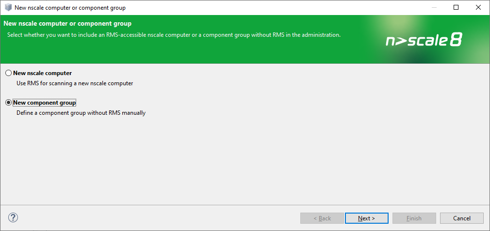

# Limitierungen

In dieser Dokumentation finden Sie eine Auflistung von Limitierungen und Einschränkungen bezüglich des Einsatzes von nscale Standard Container.
Die Grundfunktionalität von nscale Standard Container unterscheidet sich nicht von einer klassischen Installation ohne Container.
Es besteht allerdings ein Unterschied bei dem Zugriff auf Konfigurationseigenschaften.
Weitere Informationen finden Sie in diesem Dokument.

## Inhalt

- [Limitierungen](#limitierungen)
  - [Inhalt](#inhalt)
  - [nscale RMS](#nscale-rms)
  - [nscale Administrator](#nscale-administrator)
  - [nscale Server Application Layer](#nscale-server-application-layer)
  - [nscale Server Application Layer Web](#nscale-server-application-layer-web)
  - [nscale Server Storage Layer](#nscale-server-storage-layer)
  - [nscale Rendition Server](#nscale-rendition-server)
  - [nscale Monitoring Console](#nscale-monitoring-console)
  - [nscale Console](#nscale-console)
  - [nscale Pipeliner](#nscale-pipeliner)

## nscale RMS

Der nscale RMS (Remote Management Service) steht für die nscale Standard Container nicht zur Verfügung.
Verwenden Sie in nscale Administrator die Funktion "New component group" um nscale Standard Container zu konfigurieren.

Eine genaue Anleitung finden Sie im Handbuch von nscale Administrator.

## nscale Administrator

- Der Support-Assistent kann nicht verwendet werden.
- Einige Konfigurationsmerkmale können nicht über nscale Administrator gesetzt werden. Diese Konfigurationsmerkmale sind im Folgenden unter den einzelnen Komponenten aufgeführt und können statt in nscale Administrator über Umgebungsvariablen gesetzt werden.

## nscale Server Application Layer

- Die Offline-Konfiguration (z. B. alle Konfigurationsmerkmale die über die `instance1.conf` gesetzt werden können), ist in nscale Administrator nicht verfügbar.

Weitere Informationen zur nscale Server Application Layer:  
[components/application-layer.md](components/application-layer.md)

## nscale Server Application Layer Web

- Der nscale Server Application Layer Web kann nicht in nscale Administrator konfiguriert werden.  

Weitere Informationen zur nscale Server Application Layer Web:  
[components/application-layer-web.md](components/application-layer-web.md)

## nscale Server Storage Layer

- Die Offline-Konfiguration (alle Konfigurationsmerkmale die über die `storagelayer.conf` gesetzt werden können), ist in nscale Administrator nicht  verfügbar.

Weitere Informationen zum nscale Server Storage Layer:  
[components/storage-layer.md](components/storage-layer.md)

## nscale Rendition Server

- Die Offline-Konfiguration, ist in nscale Administrator nicht verfügbar.
- Das Passwort kann nicht über nscale Administrator gesetzt werden.
- Der Port kann nicht über nscale Administrator gesetzt werden.

Weitere Informationen zum nscale Rendition Server:  
[components/rendition-server.md](components/rendition-server.md)

## nscale Monitoring Console

- Die Offline-Konfiguration, ist in nscale Administrator nicht verfügbar.
- Das Passwort kann nicht über nscale Administrator gesetzt werden.
- In nscale Administrator sind die nscale-Komponenten über das Hostnetzwerk erreichbar, während nscale Monitoring Console im eigenen Compose Netzwerk bzw. Kubernetes Namespace mit den übrigen nscale-Komponenten nicht über das Hostnetzwerk kommunizieren kann.
Dadurch wird es notwendig, dass Sie in der Konfiguration der Komponenten den Hostname aus Sicht von nscale Monitoring Console nachträglich anpassen.
Diese Änderungen können Sie in nscale Administrator im Knoten `"Rechnername">Monitoring Console> Konfiguration>Ressourcen` vornehmen.
Bearbeiten Sie dazu den Hostnamen aller Komponenten.

Weitere Informationen zu nscale Monitoring Console:  
[components/monitoring-console.md](components/monitoring-console.md)

## nscale Console

- Die Offline-Konfiguration, ist in nscale Administrator nicht verfügbar.
- Die folgenden Plug-ins sind verfügbar:
  - Benutzerverwaltung
  - nstore
  - Navigator
  - Willkommen & Information
  - eGov Administration
  - AdminType
- Mit der Funktion "Kennwortänderung" können Sie Ihr Kennwort für nscale Console ändern. Die Kennwörter für die anderen Komponenten sind nicht betroffen

Weitere Informationen zur nscale Console:  
[components/console.md](components/console.md)

## nscale Pipeliner

Die Offline-Konfiguration (alle Konfigurationsmerkmale die über die `cold.xml` gesetzt werden können),
ist in nscale Administrator nicht mehr verfügbar.

Weiter Information zum nscale Pipeliner:  
[components/pipeliner.md](components/pipeliner.md)
